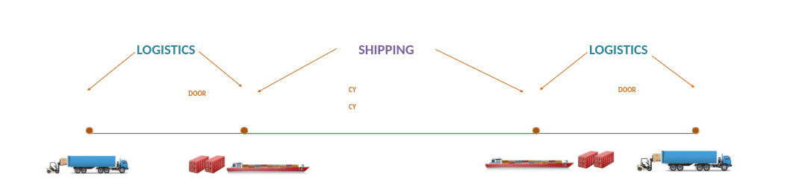

# NGHIỆP VỤ VẬN TẢI BIỂN – VSICO

## Lịch sử tài liệu

| Phiên bản        | Thực hiện        | Ghi chú |
|:-------------|:------------------|:------|
| 1.0s          | Nguyễn Đức Trung | Tạo tài liệu  |
| 1.2           | Trần Anh Dũng   | Quy trình tổng quan dịch vụ Logistics  |
| 2.1           | Nguyễn Viết Khuê      | Quy trình Kinh doanh   |
| 2.4           | Vũ Trường Lâm | Quy trình đối chiếu  |
| 2.8           | Vũ Thanh Tùng | Quy trình điều hành vận tải  |
| 3.0           | Lê Huyền | Quy trình Shipping  |
| 3.6           | Nguyễn Thành An| Xây dựng mô hình quy trình  |
| 3.7           | Nguyễn Đức Trung | Hoàn thiện tài liệu quy trình Shipping  |
| 3.8           | Lê Huyền | Bổ sung mẫu biểu Shipping  |

