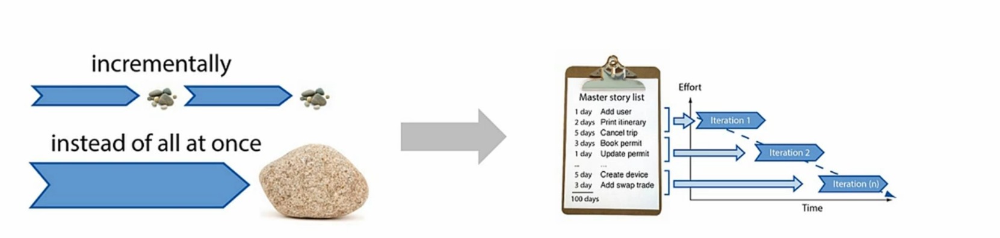

# Agile là gì?
Có thể đôi lần bạn đã nghe đến thuật ngữ này. Vậy có bao giờ bạn tự hỏi nó nghĩa là gì không? 

Nó khác gì với những thứ mà bạn đang làm? Và thực sự nó có tốt không?

Hãy nhìn vào bức tranh bên dưới:

Và đây kết quả của của 2 quy trình triển khai dự án truyền thống và Agile:

Agile là phương thức(quy trình) giúp ta triển khai và quản lý dự án. 
Agile là một quy trình lặp đi lặp lại, trong đó bạn cung cấp giá trị thông qua một giải pháp cơ bản (MVP) và sau đó cải tiến nó dần theo thời gian.
Giúp bạn cung cấp sản phẩm nhanh chóng và thường xuyên.
Và trong suốt quá trình này, bạn sẽ có sự tương tác và giao tiếp liên tục với khách hàng, để đảm bảo họ hài lòng với từng sản phẩm mà bạn cung cấp.

Khách hàng có thể bắt đầu dử dụng ngay từ lần đầu tiên. Giống như ban đầu ta chỉ có chiếc ván trượt để đi từ A đến B. Tất nhiên thì có 1 chiếc xe hơi cũng tốt hơn. Nhưng thay vì phải chờ nhiều tháng thậm chí nhiều năm. Thì ta có cái ván trượt trong thời gian ngắn để sử dụng trước vẫn tốt hơn phải ko?

Đó chính xác là nhứng gì Agile đang làm.

Giả sử bạn đang cần xây dựng 1 trang web để quản lý thuê container?
Chúng ta sẽ ko dành nhiều thời gian để viết SRS, nhiều tháng nhiều nă, để xây dựng trang Web đó.
Thay vào đó, chúng ta sẽ tạo ra 1 phiên bản cơ bản đầu tiên. 
Đó là 1 trang web cơ bản cho phép khách hàng điền thông tin cần thiết để đặt thuê 1 chiếc container.
Sau đó, bạn sẽ dần dần cải tiến nó theo thời gian và thêm vào đó nhiều trang hơn cho trang web, nhiều tính năng sản phẩm hơn theo thời gian.
Trong Agile, chúng ta gọi khoảng thời gian đó là Sprint.

Hãy xây dựng tối thiểu những gì bạn thực sự cần để cung cấp những gì khách hàng mong đợi.

Và điều này liên quan đến một khái niệm quan trọng khác trong Agile. Đó là MVP(Minium Viable Product) hay Sản phẩm khả thi tối thiểu. Nó là sản phẩm tối thiểu mà bạn có thể cung cấp và đáp ứng yêu cầu cơ bản.

## Vậy hãy tóm tắt về khái niệm Agile
Agile là một phương pháp để giao sản phẩm dần dần. Nó là một quy trình lặp lại và có giới hạn thời gian.
Khoảng thời gian đó, thường là khoảng hai tuần, được gọi là Sprint. Những gì bạn làm trong suốt hai tuần đó thường là các tính năng mang lại giá trị cho khách hàng và chúng ta gọi đó là các User Story (Câu chuyện người dùng).

## The Agile Manifesto (Tuyên Ngôn Agile)

- Cá nhân và sự tương tác quan trọng hơn quy trình và công cụ
- Phần mềm hoạt động được quan trọng hơn tài liệu đầy đủ
- Hợp tác với khách hàng quan trọng hơn đàm phán hợp đồng
- Phản hồi thay đổi quan trọng hơn việc tuân theo kế hoạch

## 12 Nguyên tắc dựa trên tuyên ngôn của Agile (The following 12 Principles are based on the Agile Manifesto.)

1. Ưu tiên cao nhất của chúng ta là làm hài lòng khách hàng thông qua việc cung cấp phần mềm có giá trị sớm và liên tục.

1. Chào đón sự thay đổi của yêu cầu, thậm chí là trong giai đoạn phát triển muộn. Các quy trình Agile khai thác sự thay đổi để mang lại lợi thế cạnh tranh cho khách hàng.

1. Cung cấp phần mềm hoạt động thường xuyên, từ vài tuần đến vài tháng, với ưu tiên cho chu kỳ ngắn hơn.

1. Người kinh doanh và các nhà phát triển phải làm việc cùng nhau hàng ngày trong suốt dự án.

1. Xây dựng dự án xung quanh những cá nhân có động lực. Cung cấp cho họ môi trường và sự hỗ trợ cần thiết, và tin tưởng họ hoàn thành công việc.

1. Phương pháp hiệu quả nhất để truyền đạt thông tin tới và trong đội ngũ phát triển là thông qua cuộc trò chuyện trực tiếp.

1. Phần mềm hoạt động được là thước đo chính của tiến độ.

1. Các quy trình Agile thúc đẩy sự phát triển bền vững. Các nhà tài trợ, nhà phát triển và người dùng nên có khả năng duy trì một nhịp độ ổn định vô hạn.

1. Sự chú ý liên tục đến xuất sắc kỹ thuật và thiết kế tốt sẽ tăng cường tính linh hoạt.

1. Tính đơn giản — nghệ thuật tối đa hóa lượng công việc chưa hoàn thành — là điều cốt yếu.

1. Kiến trúc, yêu cầu và thiết kế tốt nhất xuất hiện từ các nhóm tự tổ chức.

1. Định kỳ, đội ngũ sẽ tự phản ánh cách trở nên hiệu quả hơn, sau đó điều chỉnh và điều chỉnh hành vi của mình cho phù hợp.