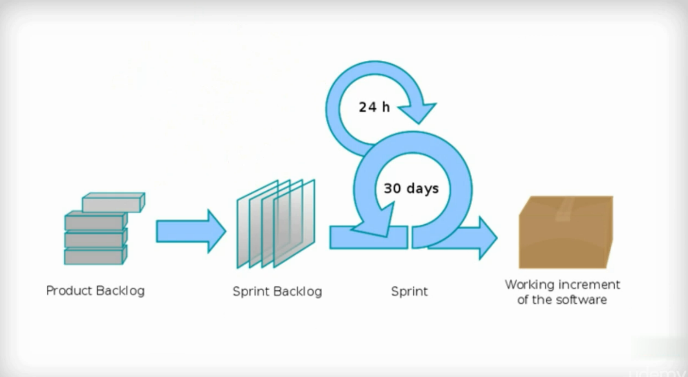

# Scrum là gì?

Scrum là 1 framework của Agile, có bổ sung thêm cái quy tắc (Scrum Team), vai trò(Role), sự kiện(Events), các tạo tác(Artifacts)

Hiểu cơ bản nhất, Scrum là một khung làm việc dễ hiểu để quản lý các dự án thành công.

Sức mạnh của Scrum: 
1. Xây dựng các nguyên tắc, quy trình quản lý dự án.
1. Hoàn thiện dự án phức tạp từ những sản phẩm tăng trưởng theo thời gian.
1. Mang lại sản phẩm chất lượng, tối đa hóa lợi nhuận và vẫn thú vị khi thực hiện
1. Khách hàng hài lòng. Dự án bàn giao theo đúng tiến độ.

{: .note }
Việc nắm vững các nguyên tắc cơ bản có nghĩa là đội ngũ chắc chắn đang trên con đường dẫn đến thành công.

Scrum là một khung làm việc giúp phát triển sản phẩm thông qua chuỗi các quy trình lặp lại gọi là Sprint, thường kéo dài từ 2-4 tuần. Trong mỗi Sprint, công việc được chia nhỏ thành các phần dễ quản lý hơn và hoàn thành bởi một đội ngũ liên chức năng. Tên gọi Scrum xuất phát từ bóng bầu dục, nơi cả đội hợp lực trong một đội hình gọi là "scrum" để đưa bóng về phía trước. Tương tự, trong các doanh nghiệp, đội nhóm dự án sẽ cùng nhau làm việc để tiến đến mục tiêu chung.

Scrum không chỉ đơn thuần là mô hình quản lý dự án theo lối chỉ huy và kiểm soát, mà nó nhấn mạnh vai trò lãnh đạo tích cực. Người quản lý nhóm sử dụng Scrum đóng vai trò như một thành viên đội ngũ, tham gia trực tiếp vào quá trình làm việc, thay vì chỉ đứng ngoài chỉ đạo.

## Scrum và Agile – Sự khác biệt
Scrum là một trong những phương pháp phổ biến nhất khi triển khai Agile, nhưng không phải là một và giống nhau. Agile là phương pháp luận quản lý dự án, trong đó dự án được chia thành các giai đoạn khác nhau, tập trung vào sự hợp tác, làm việc nhóm và cải tiến liên tục. Trong khi Agile bao gồm những giá trị và nguyên tắc cốt lõi, Scrum là cách thức cụ thể để thực hiện và triển khai những nguyên tắc đó.

## Scrum phù hợp với những dự án nào?
Mặc dù ban đầu Scrum chỉ được áp dụng trong phát triển phần mềm, nhưng giờ đây nó đã linh hoạt hơn và có thể áp dụng cho nhiều loại dự án khác nhau, từ đơn giản đến phức tạp, với quy mô từ vài người đến hàng trăm người. Scrum đặc biệt phù hợp với các dự án mà mục tiêu cuối cùng chưa được xác định rõ ngay từ đầu, bởi nó giúp liên tục cải tiến qua từng Sprint, từ đó sản phẩm ngày càng hoàn thiện và đáp ứng nhu cầu.

## Ba nguyên tắc cốt lõi của Scrum

- **Minh bạch (Transparency):** Mọi thông tin về quy trình và sản phẩm đều cần được công khai, giúp các thành viên nắm rõ tình trạng và tiến độ công việc.

- **Thanh tra (Inspection):** Liên tục kiểm tra và giám sát để kịp thời phát hiện và điều chỉnh những rủi ro.

- **Thích ứng (Adaptation):** Các thay đổi sẽ được áp dụng ngay khi cần thiết, giúp dự án luôn bám sát mục tiêu ban đầu.

## Năm giá trị cốt lõi của Scrum

1. Tập trung (Focus): Mỗi thành viên phải tập trung hoàn toàn vào công việc để đạt mục tiêu.
1. Can đảm (Courage): Đối mặt với những thay đổi và thử thách không lường trước.
1. Cam kết (Commitment): Tất cả thành viên phải cam kết hoàn thành nhiệm vụ vì lợi ích chung của dự án.
1. Cởi mở (Openness): Sẵn sàng chia sẻ và cập nhật thông tin liên quan đến dự án với tất cả các bên.
1. Tôn trọng (Respect): Tôn trọng sự đóng góp của mỗi thành viên trong nhóm.

## Vai trò trong Scrum
Scrum yêu cầu ba vai trò chính để vận hành hiệu quả:

- Product Owner: Quản lý giá trị của sản phẩm và đảm bảo dự án đáp ứng mục tiêu sản phẩm.
- Scrum Master: Người nắm vững Scrum và giúp đội ngũ vận hành một cách hiệu quả.
- Development Team: Nhóm phát triển thực hiện các công việc trong Sprint, từ lập kế hoạch đến hoàn thành.

**Scrum** là một khung làm việc mạnh mẽ và linh hoạt, giúp các đội nhóm phát triển sản phẩm một cách tối ưu, không chỉ trong phần mềm mà trong mọi lĩnh vực có yêu cầu sự đổi mới và cải tiến liên tục.

### Kicking of a Project
### Root Cause Analysis
### Benefits of Scrum
### Defination of Done
### Establishing Stakeholders 
### Scrum Roles
### Building the product Backlog
### Sprint Planning
### Release Planning using Velocity 